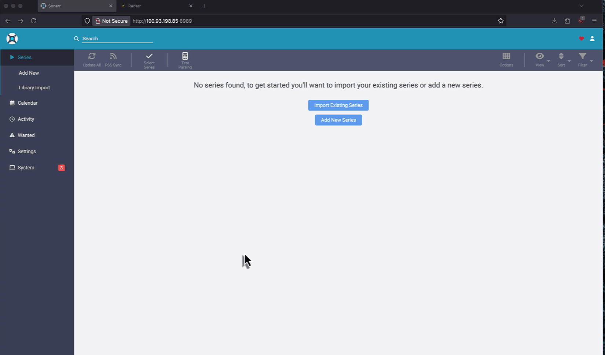
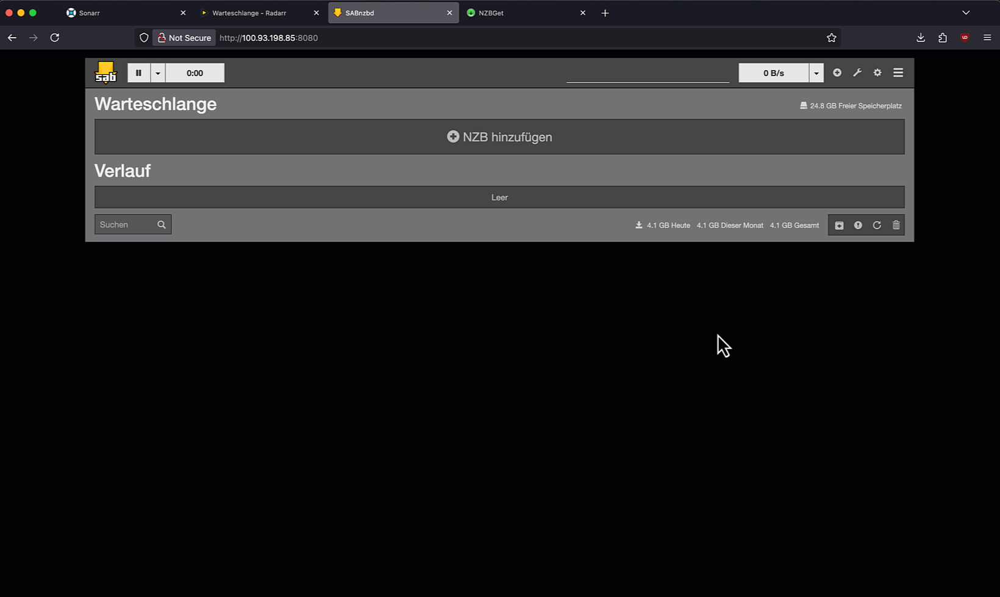
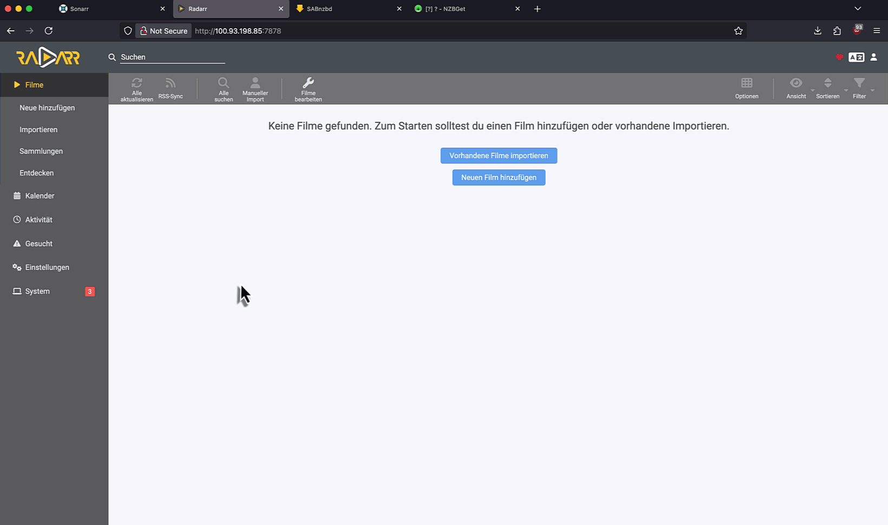

# 6.0 Prowlarr, Sonarr und Radarr

## 6.1 Was ist der "Arr"-Stack?

Die **"Arr"-Apps** (Prowlarr, Radarr, Sonarr etc.) sind das Herzstück deines Medien-Setups. Sie sind intelligente, automatisierte Tools, die das manuelle Suchen und Herunterladen von Filmen und Serien überflüssig machen.

* **Prowlarr:** Das ist der zentrale Hub für all deine Indexer (die Suchmaschinen für Usenet-Inhalte). Anstatt deine Indexer-Zugangsdaten in jeder App einzeln zu verwalten, trägst du sie nur einmal in Prowlarr ein. Das spart Zeit und Mühe.
* **Radarr:** Dein persönlicher Filmmanager. Füge einfach Filme zu Radarr hinzu, und die App sucht automatisch nach den besten Versionen, sendet den Download an SABnzbd oder NZBGet und verschiebt den fertigen Film in deinen Filmordner.
* **Sonarr:** Funktioniert genau wie Radarr, ist aber speziell für Serien optimiert. Es überwacht deine Lieblingsserien, lädt automatisch neue Episoden herunter und sortiert sie korrekt in die Serien-Ordner ein.

Das Zusammenspiel dieser Apps schafft einen vollautomatischen Workflow. Deine Aufgabe beschränkt sich dann darauf, neue Titel zu deiner Liste hinzuzufügen.

## 6.2 "Arr"-Apps installieren

Nachdem du die Funktionsweise der **"Arr"-Apps** verstanden hast, ist es an der Zeit, sie zu deinem Docker Stack hinzuzufügen. Der folgende Code-Block enthält die Konfigurationen für **Prowlarr**, **Radarr** und **Sonarr**. Du musst diesen Code einfach in deine bestehende `docker-compose.yml`-Datei einfügen. Danach können wir die einzelnen Dienste einrichten und sie so miteinander verbinden, dass dein automatisierter Download-Workflow startet.

```yaml
services:
  gluetun:
    # ... Deine bestehende Gluetun-Konfiguration
    # Hier stehen deine gemappten Ports
    
  sabnzbd: # oder NZBGet
    # ... Deine bestehende Downloader-Konfiguration
    
  prowlarr:
    image: lscr.io/linuxserver/prowlarr:latest
    container_name: prowlarr
    environment:
      - PUID=1000
      - PGID=1000
      - TZ=Europe/Berlin
    volumes:
      - ./config/prowlarr:/config
    network_mode: "service:gluetun"
    depends_on:
      - gluetun
    restart: unless-stopped

  sonarr:
    image: lscr.io/linuxserver/sonarr:latest
    container_name: sonarr
    environment:
      - PUID=1000
      - PGID=1000
      - TZ=Europe/Berlin
    volumes:
      - ./config/sonarr:/config
      - ./downloads:/downloads
      - ./tvshows:/tvshows
    network_mode: "service:gluetun"
    depends_on:
      - gluetun
      - sabnzbd # oder nzbget, je nach Downloader
    restart: unless-stopped

  radarr:
    image: lscr.io/linuxserver/radarr:latest
    container_name: radarr
    environment:
      - PUID=1000
      - PGID=1000
      - TZ=Europe/Berlin
    volumes:
      - ./config/radarr:/config
      - ./downloads:/downloads
      - ./movies:/movies
    network_mode: "service:gluetun"
    depends_on:
      - gluetun
      - sabnzbd # oder nzbget, je nach Downloader
    restart: unless-stopped
```

**Wichtiger Hinweis zu den Speicherpfaden:**
Die Konfiguration deiner "Arr"-Apps ist direkt mit den Pfaden deines Downloaders verbunden. Die Ordner, die du in der `docker-compose.yml` für SABnzbd oder NZBGet festgelegt hast, müssen auch bei Prowlarr, Radarr und Sonarr korrekt referenziert werden.

**Der Download-Pfad:**
Der `downloads`-Pfad, den du in deiner `docker-compose.yml` für SABnzbd oder NZBGet definiert hast, ist der Ort, an dem deine Dateien temporär gespeichert werden, während sie entpackt werden.

*Stelle sicher, dass dieser Pfad in den `volumes`-Sektionen von **allen** deinen Diensten (`sonarr`, `radarr`, `sabnzbd/nzbget`) identisch ist.*

**Die Medien-Pfade:**
Die Pfade `tvshows` und `movies` dienen als endgültige Speicherorte. Sobald Radarr und Sonarr die Dateien von deinem Downloader (`sabnzbd`/`nzbget`) übernommen haben, werden sie in diese Ordner verschoben, umbenannt und korrekt in deiner Film- und Serienbibliothek einsortiert.

* **`/movies`**: Dies ist der finale Zielordner für alle deine Filme. Radarr wird die fertigen Dateien hierhin verschieben.
* **`/tvshows`**: Dies ist der finale Zielordner für alle deine Serien. Sonarr wird die fertigen Episoden hierhin verschieben und sie in Staffelordner einsortieren.

```yaml
    volumes:
      - ./config/sonarr:/config
      - /mnt/name-deiner-festplatte/dein-medien-ordner/downloads:/downloads # Anpassung des Download-Pfades
      - /mnt/name-deiner-festplatte/dein-medien-ordner/tvshows:/tvshows # Anpassung des Serien-Pfades

    volumes:
      - ./config/radarr:/config
      - /mnt/name-deiner-festplatte/dein-medien-ordner/downloads:/downloads # Anpassung des Download-Pfades
      - /mnt/name-deiner-festplatte/dein-medien-ordner/movies:/movies # Anpassung des Film-Pfades
```

Überprüfe noch einmal, dass die Pfade in deiner `docker-compose.yml` korrekt auf deine gewünschten Speicherorte auf dem Host-System verweisen und dass alle Dienste die notwendigen Berechtigungen dafür haben.

Speicher die `docker-compose.yml` und starte die Dienste.

```bash
docker compose up -d
```

---

## 6.3 "Arr"-Apps konfigurieren

### 6.3.1 Prowlarr

Beginne mit Prowlarr, da es das Fundament für die anderen Dienste bildet.

* **Öffne Prowlarr im Browser:** Gehe zu `http://<deine-tailscale-ip>:9696`.
* **Autentifizierung einrichten:**
  * Benutzername und Passwort wählen
  * Login-Pflicht kann für Lokale Adressen deaktiviert werden, da wir durch Tailscale tunneln
* **Indexer hinzufügen:**
  * Navigiere zu **Indexer**.
  * Klicke auf das **Plus-Symbol (+)** und wähle die Indexer aus, die du verwenden möchtest.
  * Gib die erforderlichen Daten wie **URL** und **API-Key** ein. Du findest den API-Key in deinem Benutzerkonto auf der Indexer-Website.
  * Die meisten bekannten Indexer haben eigene Guides oder Wikis in denen das hinzufügen genau beschrieben wird.
* **Downloader verbinden:**
  * Navigiere zu **Einstellungen > Download Clients**.
  * Klicke auf das **Plus-Symbol (+)** und wähle **SABnzbd** oder **NZBGet** aus der Liste aus.
  * Trage die Hostadresse und den Port deines Downloaders ein. Die Hostadresse ist die IP-Adresse des Docker-Containers (in der Regel `127.0.0.1` oder `localhost`), und der Port ist derjenige, den du in deiner `docker-compose.yml` festgelegt hast.
  * Wenn du **Sabnzbd** nutzt, dib deinen **API-Key**, **Benutzernamen** und **Passwort** ein. Den **API-Key** findest du unter **Einstellungen > Allgemein > Sicherheit**. Außerdem musst du unter **Kategorien** einen neuen Eintrag namens **prowlarr** (kleingeschrieben) erstellen und speichern.
  * Wenn du **NZBGet** nutzt, gib deinen **Benutzernamen** und **Passwort** ein. Hier musst du ebenfalls unter **Settings > Categories** eine neue **Category** namens **Prowlarr** erstellen und speichern.
* **Sonarr und Radarr verbinden:**
  * Navigiere in **Prowlarr** zu **Einstellungen > Anwendungen** und füge **Sonarr/Radarr** hinzu. Die Einstellungen dort sollten bereits alle passen.
  * Die **API-Keys von Sonarr/Radarr** findest du jeweils unter **Einstellungen > Allgemein > Sicherheit**.

### 6.3.2 Sonarr/Radarr

Als Nächstes richtest du Radarr und Sonarr ein. Die Schritte sind bei beiden fast identisch.

* **Öffne Sonarr/Radarr:**
  * Radarr: `http://<deine-tailscale-ip>:7878`
  * Sonarr: `http://<deine-tailscale-ip>:8989`
* **Dateipfade festlegen:**
  * Gehe zu **Einstellungen > Medienverwaltung**.
  * Trage unter **Root Ordner** die Pfade zu deinen Medien-Ordnern ein. Da du in deiner `docker-compose.yml` Volumes verwendet hast, sind die Pfade für die Container `tvshows` und `movies`.


---

**Wichtiger Hinweis zu den Dateiberechtigungen:**
Ein häufiges Problem bei Docker-Setups sind die Zugriffsrechte. Deine Docker-Container laufen unter der Benutzer-ID (`PUID`) und Gruppen-ID (`PGID`) deines eigenen Systembenutzers. Damit sie Dateien herunterladen und in die richtigen Ordner verschieben können, benötigt dieser Nutzer die passenden "Schlüssel" – die Lese- und Schreibrechte für deine Festplatte. **Tun wir das nicht, kommt es beim Dateipfade festlegen zu dem sehr bekannten Problem:** `Folder is not writable for user abc`.

Als Beispiel, meine Festplatte ist unter `/mnt/16TB` gemountet und enthält mehrere Ordner:

* `/mnt/16TB/Media` (für Filme, Serien, Downloads)
* `/mnt/16TB/Backups` (für Backups deiner Daten)
* ...und möglicherweise andere private Ordner

Der naheliegendste Weg wäre, dem Docker-Benutzer einfach die Rechte für die gesamte Festplatte `/mnt/16TB` zu geben. Das wäre zwar einfach, aber **sicherheitskritisch**. Stell dir vor, du gibst einem Gast den Universalschlüssel für dein ganzes Haus, obwohl er nur Zugang zum Wohnzimmer braucht.

Die beste Lösung ist ein Kompromiss: Wir geben dem Docker-Benutzer die vollständigen Rechte für den übergeordneten Medien-Ordner (`/mnt/16TB/Media`), aber **nichts darüber hinaus**. Das schützt deine anderen privaten Daten, während der gesamte Medien-Workflow reibungslos funktioniert.

Diese Vorgehensweise hat zwei entscheidende Vorteile:

* **Sicherheit:** Deine Backups und andere persönliche Daten außerhalb des `/Media`-Ordners bleiben geschützt.
* **Einfachheit:** Du musst die Berechtigungen nur für einen einzigen Ordner festlegen, und alle Unterordner (`downloads`, `tvshows`, `movies`) erben automatisch die richtigen Rechte.

Deswegen führen wir im Terminal folgende Befehle aus:

```bash
id # Zeigt dir wieder die PUID und PGID deines Benutzers
chown -R 1000:1000 /mnt/name-deiner-festplatte/dein-medien-ordner # bei 1000:1000 die Nummer aus dem id Befehl eintragen
chmod -R 755 /mnt/name-deiner-festplatte/dein-medien-ordner # 755 gewährt dem Besitzer (deinem Docker-Benutzer) volle Lese-, Schreib- und Ausführrechte, während andere Nutzer nur Leserechte haben
```

Hiermit sollten die Benutzerrechte für deinen Medien-Ordner korrekt gesetzt sein.

---

### 6.3.3 **Downloader verbinden:**

#### Sabnzbd

* Navigiere zu den **Einstellungen > Download Clients**.
* Klicke auf das **Plus-Symbol (+)** und wähle **Sabnzbd**.
* Gebt euren **Benutzernamen** und **Passwort** ein.
* Den **API-Key** von **Sabnzbd** findest du unter **Einstellungen > Allgemein > Sicherheit**.
* Manchmal werden die **Downloadpfade** in **Sabnzbd** nicht richtig aus der `docker-compose.yml` übernommen, wenn andere Verzeichnisse als `/config` verwendet werden. Passe die Einstellungen wie folgt an:



In meinem Fall entspricht das folgenden Pfaden aus meiner `docker-compose.yml`:

```yaml
    volumes:
      - ./sabnzbd-config:/config
      - /mnt/16TB/Media/downloads:/downloads
      - /mnt/16TB/Media/incomplete-downloads:/incomplete-downloads
```

#### NZBGet

* Navigiere zu den **Einstellungen > Download Clients**.
* Klicke auf das **Plus-Symbol (+)** und wähle **NZBGet**.
* Gib deinen **Benutzernamen** und **Passwort** ein.
* Benenne die **Kategorie** in **Series** um, da das die Standard **Category2** in den **NZBGet** Einstellungen ist.
* Anschließend müssen wir noch das **Remote-Mapping** anpassen:



---

Sobald diese Schritte abgeschlossen sind, sind deine Dienste vollständig miteinander verbunden und bereit, automatisiert Inhalte für dich zu finden und herunterzuladen. Der nächste Schritt wird Jellyfin.
