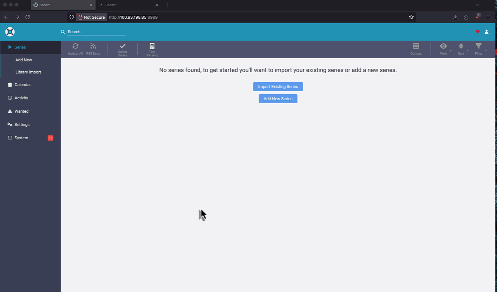
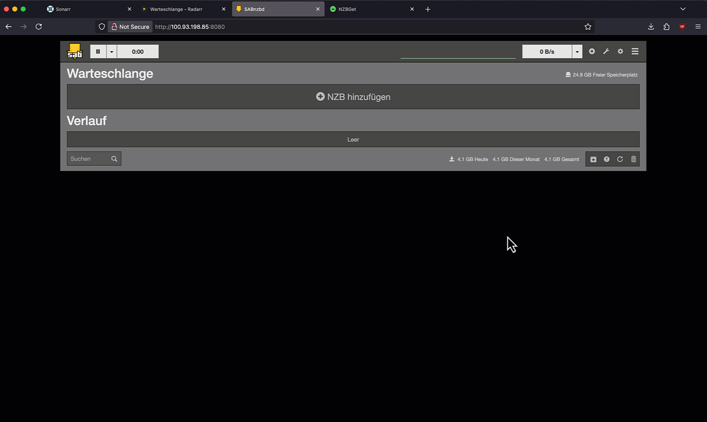

# 6.0 Prowlarr, Sonarr und Radarr

## 6.1 Was ist der "Arr"-Stack?

Die **"Arr"-Apps** (Prowlarr, Radarr, Sonarr etc.) sind das Herzstück deines Medien-Setups. Sie sind intelligente, automatisierte Tools, die das manuelle Suchen und Herunterladen von Filmen und Serien überflüssig machen.

* **Prowlarr:** Das ist der zentrale Hub für all deine Indexer (die Suchmaschinen für Usenet-Inhalte). Anstatt deine Indexer-Zugangsdaten in jeder App einzeln zu verwalten, trägst du sie nur einmal in Prowlarr ein. Prowlarr synchronisiert sie dann automatisch mit Sonarr und Radarr.
* **Radarr:** Dein persönlicher Filmmanager. Füge einfach Filme zu Radarr hinzu, und die App sucht automatisch nach den besten Versionen, sendet den Download an SABnzbd oder NZBGet und verschiebt den fertigen Film in deinen Filmordner.
* **Sonarr:** Funktioniert genau wie Radarr, ist aber speziell für Serien optimiert. Es überwacht Staffeln und Episoden, lädt automatisch neue Folgen herunter und sortiert sie strukturiert in Serien- und Staffelordner ein.

Das Zusammenspiel dieser Apps schafft einen vollautomatischen Workflow. Deine Aufgabe beschränkt sich darauf, neue Titel zu deiner Liste hinzuzufügen.

---

## 6.2 "Arr"-Apps installieren

Füge die folgenden Dienste zu deiner bestehenden `docker-compose.yml`-Datei hinzu:

```yaml
services:
  gluetun:
    # ... Deine bestehende Gluetun-Konfiguration
    # Hier stehen deine gemappten Ports (8080, 6789, 7878, 8989, 9696)
    
  sabnzbd: # oder nzbget
    # ... Deine bestehende Downloader-Konfiguration
    
  prowlarr:
    image: lscr.io/linuxserver/prowlarr:latest
    container_name: prowlarr
    environment:
      - PUID=1000 # Ersetze mit deiner PUID
      - PGID=1000 # Ersetze mit deiner PGID
      - TZ=Europe/Berlin
    volumes:
      - ./config/prowlarr:/config
    network_mode: "service:gluetun"
    depends_on:
      - gluetun
    restart: unless-stopped

  sonarr:
    image: lscr.io/linuxserver/sonarr:latest
    container_name: sonarr
    environment:
      - PUID=1000 # Ersetze mit deiner PUID
      - PGID=1000 # Ersetze mit deiner PGID
      - TZ=Europe/Berlin
    volumes:
      - ./config/sonarr:/config
      - ./data:/data
    network_mode: "service:gluetun"
    depends_on:
      - gluetun
      - sabnzbd # oder nzbget
    restart: unless-stopped

  radarr:
    image: lscr.io/linuxserver/radarr:latest
    container_name: radarr
    environment:
      - PUID=1000 # Ersetze mit deiner PUID
      - PGID=1000 # Ersetze mit deiner PGID
      - TZ=Europe/Berlin
    volumes:
      - ./config/radarr:/config
      - ./data:/data
    network_mode: "service:gluetun"
    depends_on:
      - gluetun
      - sabnzbd # oder nzbget
    restart: unless-stopped
```

### Wichtiger Hinweis zu den Speicherpfaden (TRaSH-Guides Standard)

Die Konfiguration deiner *arr-Apps ist direkt mit den Pfaden deines Downloaders verbunden. Wir setzen konsequent auf den **TRaSH-Guides Standard**:

* Alle Container binden denselben zentralen Pfad ein: `- ./data:/data`.
* **Download-Pfade:** SABnzbd/NZBGet speichert fertige Downloads unter `/data/usenet/complete`.
* **Medien-Pfade:** Sonarr sortiert Serien nach `/data/media/tv` ein, Radarr verschiebt Filme nach `/data/media/movies`.

> ⚡ **Warum ein einziges `/data`-Volume so wichtig ist (Instant Atomic Moves):**
> Werden Downloads und Medien als getrennte Volumes eingebunden (z. B. `/downloads` und `/movies`), behandelt Docker sie im Container als zwei unterschiedliche Festplatten. Beim Import muss jede Datei mühsam **vollständig kopiert und danach gelöscht** werden (Slow I/O Copy).
> Durch das gemeinsame Root-Volume `/data` können Sonarr und Radarr die Dateien per **Atomic Move (`rename()`) in Millisekunden** an ihren Zielort verschieben – ohne Schreiblast, ohne CPU-Stress und ohne Verzögerung.

Wenn du eine externe Festplatte nutzt (z. B. gemountet unter `/mnt/name-deiner-festplatte/medien`), passe die Volumes einfach wie folgt an:

```yaml
    volumes:
      - ./config/sonarr:/config
      - /mnt/name-deiner-festplatte/medien:/data

    volumes:
      - ./config/radarr:/config
      - /mnt/name-deiner-festplatte/medien:/data
```

---

### Dateiberechtigungen auf dem Host setzen

Damit die Docker-Container Dateien auf deiner Festplatte anlegen und verschieben können, benötigt dein Benutzer Schreibrechte:

```bash
# Zeigt dir die PUID und PGID deines Benutzers
id

# Besitzer für den Datenordner rekursiv anpassen (Zahlen 1000 durch deine PUID/PGID ersetzen)
sudo chown -R 1000:1000 ./data  # bzw. /mnt/name-deiner-festplatte/medien

# Berechtigungen setzen (Lesen & Schreiben für Besitzer)
sudo chmod -R 755 ./data        # bzw. /mnt/name-deiner-festplatte/medien
```

Speichere die Datei und starte die Dienste:

```bash
docker compose up -d
```

---

## 6.3 "Arr"-Apps konfigurieren

### 6.3.1 Prowlarr einrichten

Prowlarr verwaltet zentral deine Indexer und verbindet sie mit Sonarr/Radarr:

* **Prowlarr aufrufen:** Öffne `http://<deine-tailscale-ip>:9696` (oder deine Server-IP) im Browser.
* **Authentifizierung:** Lege im Assistenten einen Benutzernamen und ein sicheres Passwort fest.
* **Indexer hinzufügen:**
  * Navigiere zu **Indexers** und klicke auf das **Plus (+)**.
  * Wähle deinen Indexer (z. B. *Treasure-Maps*, *NZBGeek*, *DrunkenSlug* etc.) aus.
  * Trage deinen **API-Key** und die **URL** deines Indexers ein und klicke auf **Save**.
* **Downloader verbinden:**
  * Gehe zu **Settings > Download Clients** und klicke auf **(+)**.
  * Wähle **SABnzbd** oder **NZBGet** aus.
  * **Host:** `127.0.0.1` oder `localhost` (da sie im selben Netzwerk laufen) mit dem jeweiligen Port (`8080` für SABnzbd, `6789` für NZBGet).
  * Trage den **API-Key** deines Downloaders ein.
* **Sonarr und Radarr synchronisieren:**
  * Gehe zu **Settings > Applications** und klicke auf **(+)**.
  * Wähle **Sonarr** bzw. **Radarr** aus.
  * **Prowlarr Server:** `http://127.0.0.1:9696`
  * **Sonarr Server:** `http://127.0.0.1:8989` (bzw. Radarr: `http://127.0.0.1:7878`).
  * Trage den jeweiligen **API-Key** aus Sonarr/Radarr ein (zu finden unter *Settings > General > Security*).
  * Klicke auf **Save**. Prowlarr überträgt nun alle konfigurierten Indexer automatisch an Sonarr und Radarr!

---

### 6.3.2 Sonarr & Radarr einrichten

* **Oberflächen öffnen:**
  * **Sonarr:** `http://<deine-tailscale-ip>:8989`
  * **Radarr:** `http://<deine-tailscale-ip>:7878`
* **Root-Ordner für Medien festlegen:**
  * Navigiere zu **Settings > Media Management**.
  * Klicke ganz unten auf **Add Root Folder**.
  * Wähle für Sonarr `/data/media/tv` und für Radarr `/data/media/movies`.



* **Download Client in Sonarr & Radarr verbinden:**
  * Gehe zu **Settings > Download Clients** und füge **SABnzbd** (Port `8080`) oder **NZBGet** (Port `6789`) mit Host `127.0.0.1` und deinem API-Key hinzu.
  * Lege als Kategorie für Sonarr `tv` und für Radarr `movies` fest.



---

## 6.4 Deutsche Tonspuren & German DL einstellen (TRaSH Guides)

Standardmäßig laden Sonarr und Radarr englischsprachige Originalversionen herunter. Wenn du bevorzugt deutschsprachige oder zweisprachige Releases (**German DL** = Dual Language) möchtest, nutzt du das Punkte-System (*Custom Formats*):

1. **Custom Formats einbinden:**
   * Gehe in Sonarr/Radarr zu **Settings > Custom Formats**.
   * Importiere die offiziellen deutschen Formate aus den [TRaSH Guides (German Audio)](https://trash-guides.info/Radarr/Radarr-collection-of-custom-formats/#german).
2. **Punktzahl (Score) im Qualitätsprofil zuweisen:**
   * Navigiere zu **Settings > Profiles** und wähle dein Standard-Profil (z. B. `HD-1080p`).
   * Vergib für Formate wie **`German DL`** oder **`German`** eine hohe Punktzahl (z. B. **`+1000`**).
   * Formate ohne deutsche Tonspur erhalten `0` Punkte.
   * *Ergebnis:* Sonarr und Radarr sortieren Suchtreffer automatisch so, dass immer die deutsche Sprachfassung gewählt und geladen wird.