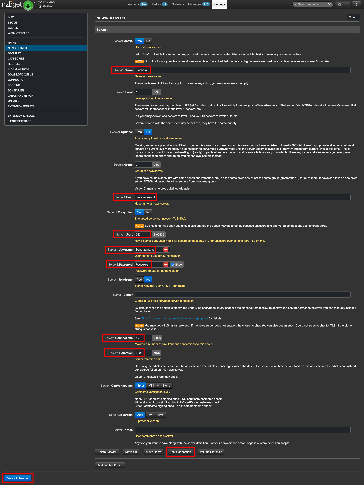

# 4.0 Usenet Downloader: SABnzbd vs. NZBGet

Nachdem dein sicheres Netzwerk mit Gluetun und Tailscale steht, geht es an das Herzstück deines Setups: den Usenet-Downloader. Wir stellen dir hier zwei der beliebtesten Optionen vor, **SABnzbd** und **NZBGet**, mit denen du die richtige Wahl für dich treffen kannst.

---

## SABnzbd vs. NZBGet: Der Vergleich

| | SABnzbd | NZBGet |
| :--- | :--- | :--- |
| **Codebasis** | **Interpretiert (Python)**. Kann bei sehr hohen Geschwindigkeiten (über 500 Mbits/s) an seine Grenzen stoßen. | **Kompiliert (C++)**. Extrem performant und effizient, ideal für Gigabit-Bandbreiten. |
| **Vorteile** | - Sehr benutzerfreundliche Oberfläche.  <br>- Größere und sehr aktive Community.  <br>- Umfangreiche und ausgereifte Features. | - Sehr hohe Performance.  <br>- Deutlich geringere CPU- und RAM-Auslastung.  <br>- Ideal für schnelle Internetverbindungen. |
| **Nachteile** | - Performance-Grenzen bei Gigabit-Geschwindigkeiten.  <br>- Etwas höherer Ressourcenverbrauch. | - Webinterface funktional, aber weniger modern.  <br>- Die Konfiguration kann etwas technischer sein. |

**Empfehlung:** Für einen performanten Betrieb auf einem **Raspberry Pi 5** oder mit einer schnellen Internetleitung ist **NZBGet** die bessere Wahl. Wenn du Wert auf ein modernes Interface und eine breitere Feature-Palette legst, ist **SABnzbd** eine sehr gute Alternative.

---

### 4.1 Downloader zur docker-compose.yml hinzufügen

Wir zeigen dir hier die Konfiguration für beide Downloader. Du msolltest dich für einen der beiden entscheiden und den nicht benötigten Teil aus deiner Datei entfernen oder auskommentieren, kannst aber testweise auch erstmal beide aufsetzen.

#### Schritt 1: Konfigurations- und Downloadordner erstellen

Führe diese Befehle im Haupt-Docker-Verzeichnis aus, um die Ordner für deine Konfiguration und deine Downloads anzulegen:

```bash
mkdir sabnzbd-config nzbget-config
mkdir downloads
```

##### Wichtiger Hinweis zu Speicherpfaden

Wenn du deine Downloads auf einem anderen Speicherort ablegen möchtest, z. B. auf einer externen Festplatte, musst du den Pfad in der `docker-compose.yml` anpassen.

Der Standardpfad `downloads` verweist auf einen Ordner im selben Verzeichnis wie deine `docker-compose.yml`. Möchtest du stattdessen eine externe Festplatte verwenden, die unter `/mnt/name-der-festplatte` gemountet ist, ändere die `volumes`-Sektion wie folgt:

```yaml
volumes:
  - ./sabnzbd-config:/config 
  - /mnt/name-der-festplatte/downloads:/downloads # Hier wird der Pfad angepasst
```

  Stelle sicher, dass der angegebene Ordner (/mnt/ext_drive/downloads) auf deinem Host-System existiert und der Benutzer, unter dem die Container laufen (PUID), die notwendigen Schreibrechte besitzt.

#### Schritt 2: docker-compose.yml anpassen

Füge die folgenden Dienste-Blöcke zu deiner bestehenden docker-compose.yml-Datei hinzu. Achte darauf, dass du deine persönlichen PUID, PGID, TZ und Speicherort einträgst.

```yaml
services:
  tailscale:
    # ... dein Tailscale-Dienst ...

  # Optional: SABnzbd Downloader
  sabnzbd:
    image: lscr.io/linuxserver/sabnzbd:latest
    container_name: sabnzbd
    environment:
      - PUID=1000 # Ersetze 1000 mit deiner PUID
      - PGID=1000 # Ersetze 1000 mit deiner PGID
      - TZ=Europe/Berlin
    volumes:
      - ./sabnzbd-config:/config # Speichert die Konfiguration
      - ./downloads:/downloads # Ordner für Downloads
    ports:
      - 8080:8080 # Webinterface für SABnzbd
    restart: unless-stopped
    network_mode: "service:gluetun"

  # Optional: NZBGet Downloader
  nzbget:
    image: lscr.io/linuxserver/nzbget:latest
    container_name: nzbget
    environment:
      - PUID=1000 # Ersetze 1000 mit deiner PUID
      - PGID=1000 # Ersetze 1000 mit deiner PGID
      - TZ=Europe/Berlin
    volumes:
      - ./nzbget-config:/config # Speichert die Konfiguration
      - ./downloads:/downloads # Ordner für Downloads
    ports:
      - 6789:6789 # Webinterface für NZBGet
    restart: unless-stopped
    network_mode: "service:gluetun"
```

**Wichtiger Hinweis:** Die Zeile network_mode: "service:gluetun" ist bei beiden Diensten entscheidend. Sie sorgt dafür, dass der gesamte Download-Traffic automatisch über das VPN geleitet wird.

#### Schritt 3: Dienst starten und Webinterface aufrufen

Nachdem du den gewünschten Downloader-Block in deine `docker-compose.yml` eingefügt hast, starte den Dienst mit dem gewohnten Befehl:

```bash
docker compose up -d
```

Anschließend kannst du über die entsprechende Adresse auf das Webinterface zugreifen:

* **SABnzbd:** `http://deine-server-ip:8080` oder über deine Tailscale-IP-Adresse
* **NZBGet:** `http://deine-server-ip:6789` oder über deine Tailscale-IP-Adresse

---

### 4.2 Downloader konfigurieren: Usenet-Provider

Nachdem du den Downloader deiner Wahl gestartet hast, musst du ihn nur mit deinem Usenet-Provider verbinden. Die Indexer-Konfiguration wird später von **Prowlarr** übernommen, welches die Suchanfragen zentral verwaltet und an den Downloader schickt.

Absolut, das ist eine sehr gute Idee, um den Guide noch klarer und praktischer zu gestalten. Es ist besser, die Schritte für jeden Downloader einzeln zu zeigen, da die Benutzeroberflächen unterschiedlich sind.

Hier sind zwei separate Abschnitte, die du in deinen Guide einfügen kannst.

### SABnzbd: Usenet-Provider konfigurieren

In SABnzbd ist die Einrichtung deines Usenet-Providers schnell erledigt. Die Benutzeroberfläche ist sehr intuitiv.

1. **Navigiere zu den Einstellungen:** Klicke in der SABnzbd-Oberfläche oben rechts auf das Zahnrad-Symbol, um in die Einstellungen zu gelangen.
2. **Füge einen neuen Server hinzu:** Wähle im Menü auf der linken Seite **"Server"**. Klicke anschließend auf **"Server hinzufügen"**.
3. **Trage die Provider-Details ein:** Gib die Informationen deines Usenet-Anbieters in die Felder ein.
    * **Hostname:** Die Server-Adresse deines Anbieters (z. B. `news.provider.com`).
    * **Port:** Setze diesen immer auf **`563`** für eine sichere, verschlüsselte Verbindung.
    * **Benutzername & Passwort:** Deine Anmeldedaten.
    * **Verbindungen:** Die Anzahl der parallelen Verbindungen. Ein hoher Wert wie **`50`** ist meist optimal.
    * **SSL:** Stelle sicher, dass die Box **"SSL verwenden"** angekreuzt ist.
4. **Teste und speichere:** Klicke auf **"Server testen"**, um zu überprüfen, ob die Verbindung funktioniert. Wenn der Test erfolgreich ist, klicke auf **"Änderungen speichern"**.

### NZBGet: Usenet-Provider konfigurieren

NZBGet ist minimalistischer, aber die Einrichtung ist genauso unkompliziert. Du findest alle relevanten Einstellungen im Konfigurationsmenü.

1. **Navigiere zu den Einstellungen:** Klicke im NZBGet-Webinterface auf **"Settings"**.
2. **Füge einen neuen Server hinzu:** Wähle in der linken Leiste den Abschnitt **"NEWS-SERVERS"** aus. Hier kannst du die Daten deines Providers hinzufügen.
3. **Trage die Provider-Details ein:** Gib die Informationen deines Providers in die entsprechenden Felder ein.
    * **Name:** Wähle einen beschreibenden Namen (z. B. `Eweka.nl`).
    * **Host:** Die Server-Adresse deines Anbieters.
    * **Verschlüsselung:** Setze diese Einstellung auf **`ja`**, um SSL zu aktivieren.
    * **Port:** Setze den Wert auf **`563`**.
    * **Benutzername & Passwort:** Deine Anmeldedaten.
    * **Verbindungen:** Die Anzahl der parallelen Verbindungen. `50` ist ein guter Ausgangswert, aber je nach Provider und Abomodell unterschiedlich.
    * **Retention:** Keine Pflichtangabe, kann man der Vollständigkeit halber aber trotzdem eintragen.
4. **Teste und speichere:** Klicke unten auf **"Save all changes"**. Anschließend kannst du über **"Test Connection"** überprüfen, ob die Verbindung erfolgreich ist.


