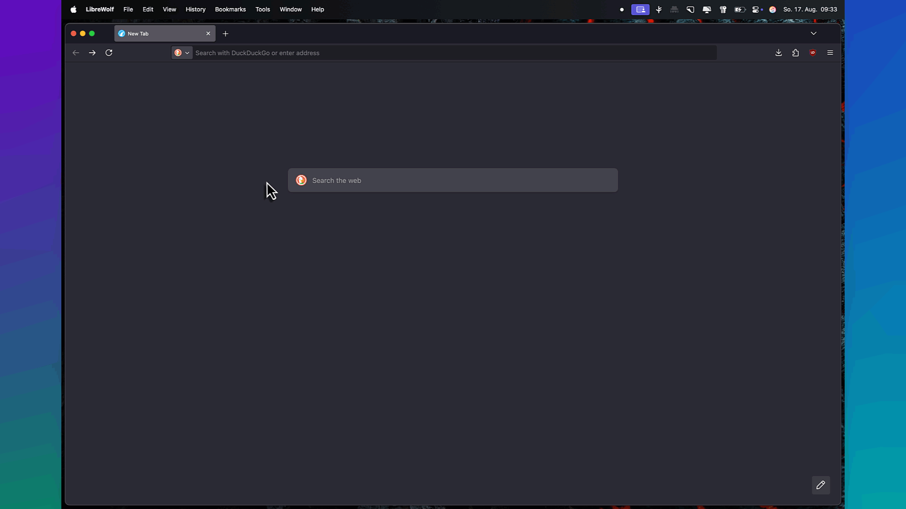

# 5.0 Usenet Downloader: SABnzbd vs. NZBGet

Nachdem dein sicheres Netzwerk mit Gluetun und Tailscale steht, geht es an das Herzstück deines Setups: den Usenet-Downloader. Wir stellen dir hier die beiden beliebtesten Optionen vor, **SABnzbd** und **NZBGet**, damit du die passende Wahl für dein System und deine Internet-Bandbreite treffen kannst.

---

## SABnzbd vs. NZBGet: Der Performance-Vergleich

Gerade beim Betrieb auf einem **Raspberry Pi 5** oder stromsparenden Mini-PCs spielt die Programmiersprache und Architektur des Downloaders eine entscheidende Rolle für die erreichbare Geschwindigkeit.

| Kriterium | SABnzbd | NZBGet |
| :--- | :--- | :--- |
| **Codebasis** | **Interpretiert (Python)**. Sehr modern, aktiv gepflegt und modular. | **Kompiliert (C++)**. Extrem performant, Multi-Threaded und nativ optimiert. |
| **Max. Durchsatz (Raspberry Pi 5)** | **Ca. 400–500 Mbit/s** (~50–60 MB/s). Durch den Python-Overhead (GIL & Dekodierung) bremst die CPU bei hohen Gigabit-Raten ab. | **1.000 Mbit/s+ (Volles Gigabit)**. Reizt auch Gigabit-Leitungen auf dem Pi 5 spielend aus (~115 MB/s). |
| **CPU- & RAM-Auslastung** | Mittel bis hoch bei schnellen Downloads. | Extrem niedrig (< 15–20 % CPU-Last bei Gigabit-Download). |
| **Benutzeroberfläche** | Sehr modern, intuitiv und einsteigerfreundlich. | Funktional und minimalistisch, aber etwas altbackener. |
| **Automatisierung** | Hervorragende Fehlerreparatur (Auto-PAR2) & Direktes Entpacken. | Sehr zuverlässig mit geringem Speicherbedarf. |

### 🎯 Entscheidungshilfe: Welcher Downloader für dich?

* **Wähle NZBGet, wenn:**
  * Du eine **schnelle Internetleitung (500 bis 1.000 Mbit/s Gigabit)** hast und diese auf deinem **Raspberry Pi 5** voll ausnutzen willst.
  * Du maximale Ressourceneffizienz und minimalen Stromverbrauch anstrebst.
* **Wähle SABnzbd, wenn:**
  * Deine Leitung **bis zu 400–500 Mbit/s** beträgt oder du einen leistungsstärkeren x86-Server (z. B. Intel N100 oder Core i3/i5) nutzt.
  * Du die modernste Weboberfläche mit vielen Komfortfunktionen bevorzugst.

---

## 5.1 Downloader zur docker-compose.yml hinzufügen

Wir zeigen dir hier die Konfiguration für beide Downloader. Du solltest dich für einen der beiden entscheiden und den nicht benötigten Teil auskommentieren oder weglassen.

### Konfigurations- und Downloadordner erstellen

Führe diese Befehle im Docker-Verzeichnis aus:

```bash
mkdir -p config/sabnzbd config/nzbget
mkdir -p downloads incomplete-downloads
```

#### Wichtiger Hinweis zu Speicherpfaden

Wenn du deine Downloads auf einer externen Festplatte ablegen möchtest (z. B. gemountet unter `/mnt/name-der-festplatte/medien`), passe die `volumes`-Sektion entsprechend an:

```yaml
volumes:
  - ./config/sabnzbd:/config 
  - /mnt/name-der-festplatte/medien/downloads:/downloads
  - /mnt/name-der-festplatte/medien/incomplete-downloads:/incomplete-downloads
```

Stelle sicher, dass der angegebene Ordner auf deinem Host-System existiert und der Benutzer, unter dem die Container laufen (`PUID`), die notwendigen Schreibrechte besitzt.

---

### Option A: SABnzbd hinzufügen

```yaml
  sabnzbd:
    image: lscr.io/linuxserver/sabnzbd:latest
    container_name: sabnzbd
    environment:
      - PUID=1000 # Ersetze mit deiner PUID
      - PGID=1000 # Ersetze mit deiner PGID
      - TZ=Europe/Berlin
    volumes:
      - ./config/sabnzbd:/config
      - ./downloads:/downloads
      - ./incomplete-downloads:/incomplete-downloads
    restart: unless-stopped
    depends_on:
      - gluetun
    network_mode: "service:gluetun"
```

---

### Option B: NZBGet hinzufügen

```yaml
  nzbget:
    image: lscr.io/linuxserver/nzbget:latest
    container_name: nzbget
    environment:
      - PUID=1000 # Ersetze mit deiner PUID
      - PGID=1000 # Ersetze mit deiner PGID
      - TZ=Europe/Berlin
    volumes:
      - ./config/nzbget:/config
      - ./downloads:/downloads
      - ./incomplete-downloads:/incomplete-downloads
    restart: unless-stopped
    depends_on:
      - gluetun
    network_mode: "service:gluetun"
```

> **Wichtiger Hinweis:** Die Zeile `network_mode: "service:gluetun"` leitet den gesamten Datenverkehr des Downloaders über den VPN-Tunnel.

#### Dienst starten und Webinterface aufrufen

Starte den Stack mit:

```bash
docker compose up -d
```

Anschließend erreichst du das Webinterface:

* **SABnzbd:** `http://deine-server-ip:8080` oder `http://<tailscale-ip>:8080`
  * *Tipp:* Wenn du SABnzbd über Tailscale aufrufst und eine Zugriffsmeldung erhältst, kannst du in der Datei `./config/sabnzbd/sabnzbd.ini` die Option `inet_exposure = 5` setzen.
* **NZBGet:** `http://deine-server-ip:6789` oder `http://<tailscale-ip>:6789`

---

## 5.2 Downloader konfigurieren: Usenet-Provider & Server-Prioritäten

### 💡 Wichtig: Haupt-Provider vs. Backup-Blockaccount richtig einrichten

Wenn du neben deiner Flatrate (z. B. Eweka) einen Block-Account (z. B. NewsgroupDirect) als Backup nutzt, musst du **Prioritäten** vergeben, damit dein bezahltes Datenvolumen nicht unnötig verbraucht wird:

* **Haupt-Provider (Flatrate):** Priorität auf **`0`** setzen.
* **Block-Account (Backup):** Priorität auf **`1`** (oder höher) setzen bzw. als **„Backup-Server“ / „Optional Server“** markieren.
* *Effekt:* Der Downloader lädt 100 % der Daten vom Hauptprovider. Nur wenn dort ein Segment durch DMCA gelöscht wurde, holt er genau diesen fehlenden Teil vom Backup-Blockaccount.

---

### SABnzbd: Usenet-Provider einrichten

1. **Einstellungen öffnen:** Klicke oben rechts auf das **Zahnrad-Symbol ⚙️**.
2. **Server-Menü:** Wähle links **"Server"** und klicke auf **"Server hinzufügen"**.
3. **Provider-Details eintragen:**
   * **Hostname:** Die News-Server-Adresse (z. B. `news.eweka.nl`).
   * **Port:** **`563`** (oder `443`) für verschlüsseltes SSL/TLS.
   * **SSL:** Haken bei **"SSL verwenden"** setzen.
   * **Benutzername & Passwort:** Deine Zugangsdaten vom Provider.
   * **Verbindungen:** Starte mit **`15–25`** Verbindungen.
   * **Priorität:** `0` für Hauptserver, `1` für Block-Account.
4. **Performance-Tipp (Direct Unpack):**
   * Gehe zu **Einstellungen > Schalter** und aktiviere **Direktes Entpacken** (*Direct Unpack*). Dateien werden bereits während des Herunterladens entpackt – das spart viel Zeit und Speicherplatz.
5. **Testen & Speichern:** Klicke auf **"Server testen"** und danach auf **"Änderungen speichern"**.



---

### NZBGet: Usenet-Provider einrichten

1. **Einstellungen öffnen:** Klicke im Menü auf **"Settings"**.
2. **News-Server:** Wähle in der linken Leiste **"NEWS-SERVERS"**.
3. **Server-Daten eintragen:**
   * **Name:** Z. B. `Eweka`.
   * **Host:** Die Server-Adresse des Anbieters.
   * **Port:** **`563`**.
   * **Encryption:** Auf **`yes`** (SSL aktivieren) setzen.
   * **User & Password:** Deine Anmeldedaten.
   * **Connections:** Starte mit ca. **`20`** Verbindungen (bei Gigabit-Leitungen bis zu 30–40).
   * **Level:** Setze `0` für den Hauptserver und `1` für Blockaccounts.
4. **Pfade anpassen:** Unter **Settings > Paths** überprüfe, dass **DestDir** auf `/downloads` und **InterDir** auf `/incomplete-downloads` eingestellt ist.
5. **Speichern:** Klicke auf **"Save all changes"** und teste mit **"Test Connection"**.

