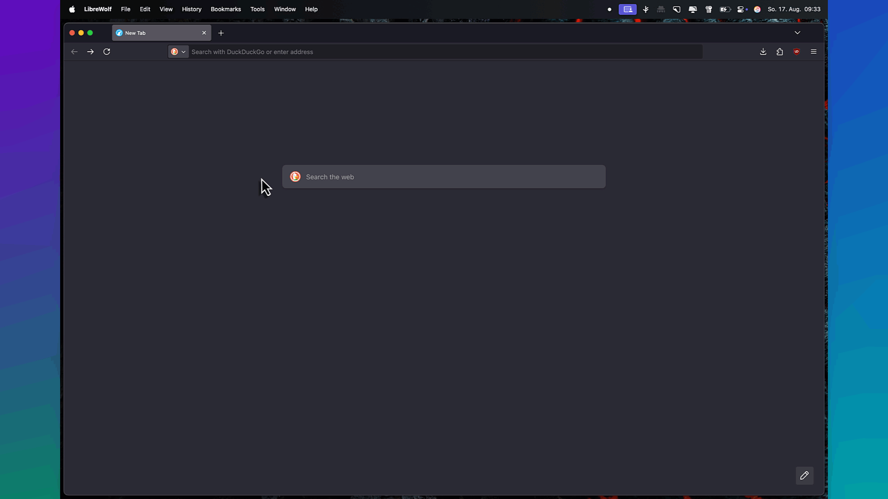

# 5.0 Usenet Downloader: SABnzbd vs. NZBGet

Nachdem dein sicheres Netzwerk mit Gluetun und Tailscale steht, geht es an das Herzstück deines Setups: den Usenet-Downloader. Wir stellen dir hier die beiden führenden Optionen vor – **SABnzbd** (unsere Standard-Empfehlung) und **NZBGet** (die leichtgewichtige Alternative für speicherarme Systeme).

---

## SABnzbd vs. NZBGet: Moderne Performance-Analyse & Mythen-Check

Lange Zeit hielt sich in der Usenet-Community das Vorurteil: *„Python-basierte Downloader wie SABnzbd sind zu schwerfällig für sparsame Hardware wie den Raspberry Pi – wer Gigabit will, muss zwingend das in C++ geschriebene NZBGet nutzen.“*

**Unsere aktuellen Hardware-Benchmarks widerlegen diesen Mythos eindeutig.**

Moderne Versionen von SABnzbd nutzen Python mit **`sabctools`** – nativen, hochoptimierten C-Erweiterungen mit Hardware-SIMD-Unterstützung (**ARM NEON** auf dem Raspberry Pi 5 und **AVX2** auf x86-Systemen). Damit wird die CPU-intensive yEnc-Dekodierung und CRC32-Prüfsummenberechnung direkt auf Hardware-Ebene ausgeführt.

| Kriterium | SABnzbd *(⭐ Standard-Empfehlung)* | NZBGet *(Leichtgewicht)* |
| :--- | :--- | :--- |
| **Architektur** | Python mit nativen C-Erweiterungen (**`sabctools`** mit ARM NEON & AVX2 SIMD). | Natives, Multi-Threaded C++. |
| **Max. Durchsatz (Raspberry Pi 5)** | **Volles Leitungs-Maximum (59,3+ MB/s Netto bei 500 Mbit/s / 115+ MB/s bei Gigabit)**. 1 GB Testdateien in ~18 s. | **Volles Leitungs-Maximum (59,3+ MB/s Netto bei 500 Mbit/s / 115+ MB/s bei Gigabit)**. 1 GB Testdateien in ~20 s. |
| **Cloud VPS (2 vCPU / AMD EPYC)** | **Hervorragend (64 MB/s)** bei 10–20 Verbindungen dank dynamischem TCP-Window-Scaling. | **39–47 MB/s** bei 10–20 Verbindungen. |
| **Arbeitsspeicher (RAM)** | ~350 MB bis 1,2 GB (je nach konfiguriertem RAM-Schreibcache). | **Extrem genügsam** (~40–60 MB im Leerlauf, ~150–250 MB unter Vollast). |
| **Prozessorlast** | Sehr moderat dank SIMD-Hardwarebeschleunigung. | Minimal (< 15 % CPU-Auslastung bei Gigabit). |
| **Direct Unpack** | **Nativ integriert**: Entpackt RAR-Archive parallel während des Downloads (*Einstellungen > Schalter*). | **Nativ integriert**: Entpackt RAR-Archive parallel während des Downloads (*Settings > UNPACK > DirectUnpack*). |
| **Weboberfläche & UX** | Modern, intuitiv, responsive und mit erstklassiger Warteschlangenverwaltung. | Funktional und schlank, optisch jedoch etwas in die Jahre gekommen. |

---

### 💾 Der wahre Flaschenhals: I/O-Architektur & Festplatten-Thrashing

Wenn ein Usenet-Download auf einem Server oder Raspberry Pi unerwartet bei 20–30 MB/s einbricht, liegt die Ursache in 99 % der Fälle **nicht an der Prozessorleistung**, sondern an der Festplatten-Architektur:

Usenet-Downloads bestehen aus tausenden winzigen Segmenten (Artikeln), die parallel aus dem Netzwerk eintreffen. Werden diese Fragmente direkt und unzusammenhängend auf eine langsame mechanische Festplatte (HDD) geschrieben, tritt massives **Head-Thrashing** auf – die Lese-/Schreibköpfe der Festplatte springen ununterbrochen hin und her, wodurch der I/O-Durchsatz der HDD auf unter 30 MB/s zusammenbricht.

> [!TIP]
> #### ⚡ Die goldene I/O-Regel für maximale Download-Geschwindigkeit:
> 1. **Schneller Zwischenspeicher:** Der temporäre Ordner (`/data/usenet/incomplete`) muss zwingend auf einer schnellen **SSD oder NVMe** liegen (350+ MB/s Schreibdurchsatz).
> 2. **RAM-Schreibcache in SABnzbd aktivieren:** Stelle in SABnzbd unter **Einstellungen > Allgemein > Cache-Begrenzung** (`cache_limit`) einen Puffer von **`1G`** (oder mindestens `512M`) ein. Dadurch puffert SABnzbd ankommende Segmente im Arbeitsspeicher und schreibt sie in großen, sequenziellen Blöcken auf die SSD – die I/O-Last sinkt drastisch.
> 3. **Instant Atomic Move:** Nach Abschluss verschieben Sonarr und Radarr die Datei in Millisekunden per Hardlink/Atomic Move in dein Medienverzeichnis (`/data/media`), ohne Daten auf der Festplatte zeitaufwendig kopieren zu müssen.

---

### 🔌 Wie viele Verbindungen sollte ich eintragen? (Warum weniger oft mehr ist)

Ein weit verbreiteter Anfängerfehler lautet: *„Mein Provider erlaubt 50 Verbindungen, also trage ich auch 50 ein.“*

In der Praxis führt das auf vielen Systemen jedoch zum genauen Gegenteil: **Der Download wird langsamer und die CPU überlastet.**

---

#### 🧠 Warum zu viele Verbindungen kontraproduktiv sind

Jede Verbindung ist ein eigener verschlüsselter TLS-Tunnel mit eigenen Datenpaketen und Bestätigungen. 

1. **Das "Stau-auf-der-Autobahn"-Prinzip (Context Switching):**
   * Wenn ein Server mit 2 oder 4 Kernen gleichzeitig 50 Verbindungen verwalten muss, ist der Prozessor fast nur noch damit beschäftigt, zwischen den 50 Aufgaben hin- und herzuwechseln (**Context Switching**), anstatt Daten zu schreiben.
   * **In unseren Messungen:** Auf einem 2-vCPU-Server brach der Durchsatz beim Wechsel von 20 auf 30 Verbindungen um **27 % ein** (von 64 MB/s auf 46 MB/s), während die CPU-Last auf 85 % hochschoss.
2. **Die Leitung ist sowieso voll:**
   * An einem normalen Gigabit-Anschluss (1.000 Mbit/s) liefern **15 bis 20 Verbindungen bereits die vollen ~115 MB/s Netto** (100 % Leitungs-Maximum).
   * 50 Verbindungen machen den Download an einer Gigabit-Leitung **keinen einzigen Millimeter schneller** – sie erzeugen lediglich unnötige Systemlast.

---

#### 🎯 Die goldene Daumenregel für deine Einstellungen:

| Dein Setup | Empfohlene Verbindungen | Warum? |
| :--- | :---: | :--- |
| **Heimnetz / Gigabit (bis 1.000 Mbit/s)** | **15 – 20** | Reizt die Leitung zu 100 % aus bei minimaler CPU-Last. |
| **Kleiner Server / VPS (1–2 vCPUs)** | **15** | Verhindert CPU-Überlastung und Einbrüche durch Thread-Wechsel. |
| **VPN-Betrieb (Gluetun WireGuard)** | **15 – 20** | Mehr Verbindungen überwinden das VPN-Limit nicht, sondern fressen nur CPU. |
| **Multi-Gigabit Cloud-Server (> 2,5 Gbit/s)** | **40 – 50** | Nur auf starken Servern (ab 6 Kernen) und Multi-Gigabit-Anbindung nötig, um 300+ MB/s zu ziehen. |

> [!TIP]
> **Praxis-Tipp:** Starte immer mit **15 Verbindungen**. Wenn du deine vertragliche Leitungsgeschwindigkeit erreichst, belasse es dabei! Erhöhe nur in 2er-Schritten, falls deine Leitung noch nicht voll ausgelastet wird.

---

### 🎯 Entscheidungshilfe: Welcher Downloader für dich?

* **Wähle SABnzbd (Empfohlen):**
  * Du nutzt einen **Raspberry Pi 5 (4 GB oder 8 GB)**, einen **Intel N100 / x86-Homeserver** oder einen Cloud-VPS mit mindestens 2 GB RAM.
  * Du bevorzugst ein modernes, komfortables Webinterface mit exzellenter Fehlerdiagnose, detaillierter Historie und flexibler Warteschlangenverwaltung.
  * Du möchtest einen großen RAM-Schreibcache (z. B. 1 GB) nutzen, um I/O-Zugriffe auf die SSD maximal zu bündeln.
* **Wähle NZBGet:**
  * Du betreibst ein extrem sparsames System mit **unter 2 GB RAM** (z. B. Raspberry Pi 3, 1-GB-VPS oder ein altes NAS).
  * Du suchst minimale RAM-Auslastung (< 60 MB im Leerlauf, < 250 MB unter Volllast) bei voller nativer C++-Effizienz – ohne auf Features wie Direct Unpack verzichten zu müssen.

---

<details>
<summary><b>📊 Reale Hardware-Benchmark-Ergebnisse ansehen (RPi 5 vs. 2-vCPU vs. 6-vCPU Server)</b></summary>

### 1. Testumgebung & Messmethodik
* **Raspberry Pi 5:** Broadcom BCM2712 (4x Cortex-A76 @ 2.4 GHz), 8 GB RAM, NVMe SSD, 500 Mbit/s via WireGuard-VPN.
* **Cloud VPS (2 vCPU):** 2 vCPUs (AMD EPYC), 4 GB RAM, Enterprise NVMe, 1 Gbit/s Uplink via WireGuard-VPN.
* **Cloud VPS (6 vCPU):** 6 vCPUs (AMD EPYC), 8 GB RAM, Enterprise NVMe, Multi-Gigabit Uplink – getestet mit und ohne WireGuard-VPN (Gluetun).
* **Test-Payload:** Offizielles 1.000 MB SABnzbd-Testarchiv über Eweka SSL/TLS (Port 563).

### 2. Durchsatz & Downloadzeit (1 GB Testdatei)

| Server & Setup | Downloader | Verbindungen | Durchsatz | Downloadzeit | CPU-Auslastung |
| :--- | :--- | :---: | :---: | :---: | :---: |
| **RPi 5 (NVMe + 1G Cache)** | **SABnzbd** | **20** | **59,34 MB/s (100 % Leitung)** | **18,0 s** | ~35–45 % |
| **RPi 5 (NVMe)** | **NZBGet** | **20** | **59,34 MB/s (100 % Leitung)** | **20,0 s** | ~15–20 % |
| **Cloud VPS (2 vCPU AMD)** | **SABnzbd** | **10** | **64,00 MB/s** | **15,6 s** | ~40 % |
| **Cloud VPS (2 vCPU AMD)** | **NZBGet** | **10** | **39,40 MB/s** | **25,4 s** | ~18 % |
| **Cloud VPS (2 vCPU AMD)** | **SABnzbd** | **20** | **63,80 MB/s** | **15,7 s** | ~55 % |
| **Cloud VPS (2 vCPU AMD)** | **NZBGet** | **20** | **47,10 MB/s** | **21,2 s** | ~25 % |
| **Cloud VPS (2 vCPU AMD)** | **SABnzbd** | **30** | **46,80 MB/s (-27 % Einbruch)** | **21,4 s** | ~85 % (Thread Overload) |
| **Cloud VPS (6 vCPU) + VPN** | **SABnzbd** | **20** | **93,00 MB/s (VPN-Limit)** | **10,0 s** | ~52 % |
| **Cloud VPS (6 vCPU) Direkt** | **NZBGet** | **20** | **155,14 MB/s** | **7,0 s** | ~32 % |
| **Cloud VPS (6 vCPU) Direkt** | **SABnzbd** | **20** | **233,10 MB/s** | **4,0 s** | ~29 % |
| **Cloud VPS (6 vCPU) Direkt** | **NZBGet** | **50** | **135,75 MB/s** | **8,0 s** | ~30 % |
| **Cloud VPS (6 vCPU) Direkt** | **SABnzbd** | **50** | **363,30 MB/s (Maximum)** | **2,0 s** | ~28 % |

### 3. Erkenntnisse
1. **SABnzbd vs. NZBGet auf Multi-Core (6 vCPUs):**
   * **Warum waren beide auf dem Raspberry Pi 5 gleich schnell?** Auf dem Pi limitierte die **500-Mbit/s-Internetleitung** (physikalische Netto-Grenze bei ~59,3 MB/s) beide Downloader gleichermaßen. Keines der Programme kam dort an sein Rechen- oder Durchsatzlimit.
   * **Warum deklassiert SABnzbd NZBGet auf dem 6-vCPU-Server?** Bei offener Multi-Gigabit-Anbindung im Rechenzentrum entscheidet die Software-Architektur: SABnzbds moderne C-SIMD-Engine (`sabctools` mit AVX2), aggressives TCP-Window-Scaling und der konfigurierte RAM-Schreibcache schöpfen 50 Verbindungen linear bis auf **363,3 MB/s** aus. NZBGet hingegen stößt bei vielen parallelen SSL-Sockets an Thread-/Lock-Grenzen (**135,8 MB/s bei 50 Verbindungen** – SABnzbd ist fast **3x so schnell**).
2. **VPN-Leistungsverlust ermittelt (-60 % bis -74 %):**
   * Bei identischen **20 Verbindungen** sinkt die Downloadrate durch den WireGuard-Tunnel von **233,1 MB/s auf 93,0 MB/s – ein Einbruch um exakt 60,1 %** bei doppelter CPU-Last (~52 % statt ~29 %).
   * Im Vergleich zum vollen Leitungs-Maximum ohne VPN (50 Verbindungen mit 363,3 MB/s) bremst der VPN-Tunnel den Durchsatz sogar um **74,4 %** aus.
3. **Kein CPU-Zusammenbruch auf 6 vCPUs:** Auf virtualisierten 2-vCPU-Kernen brach der Durchsatz ab 20 Verbindungen um 27 % ein. Mit 6 vCPUs entfällt dieses Context-Switch-Thrashing komplett: Selbst bei 50 Verbindungen und über 360 MB/s bleibt die CPU bei entspannten ~28 % Last.
4. **Fazit:** Wer maximale Downloadraten über Gigabit erzielen will, setzt auf **SABnzbd** mit nativer SSL-Verschlüsselung des Usenet-Providers (Port 563) ohne zwischengeschalteten VPN-Tunnel.

</details>

---

## 5.1 Downloader zur docker-compose.yml hinzufügen

Wir zeigen dir hier die Konfiguration für beide Downloader. In unserem Standard-Setup kommt **SABnzbd** zum Einsatz.

### Konfigurations- und Datenordner erstellen

Führe diese Befehle im Projektverzeichnis aus:

```bash
mkdir -p config/sabnzbd config/nzbget
mkdir -p data/usenet/complete/movies data/usenet/complete/tv
mkdir -p data/usenet/incomplete
mkdir -p data/media/movies data/media/tv
```

#### Wichtiger Hinweis zu Speicherpfaden (TRaSH-Guides Standard)

Wir binden den gesamten Datenordner als ein einziges Volume (`./data:/data`) ein. Dadurch können Sonarr und Radarr später fertige Downloads über **Instant Atomic Moves** in Millisekunden in deine Mediathek verschieben, ohne die Festplatte durch zeitaufwendiges Kopieren zu belasten.

Wenn du deine Daten auf einer externen Festplatte ablegen möchtest (z. B. gemountet unter `/mnt/daten/medien`), passe die `volumes`-Sektion entsprechend an:

```yaml
volumes:
  - ./config/sabnzbd:/config 
  - /mnt/daten/medien:/data
```

Stelle sicher, dass der angegebene Ordner auf deinem Host-System existiert und der Benutzer, unter dem die Container laufen (`PUID`), die notwendigen Schreibrechte besitzt.

---

### Option A: SABnzbd hinzufügen (Standard-Empfehlung)

```yaml
  sabnzbd:
    image: lscr.io/linuxserver/sabnzbd:latest
    container_name: sabnzbd
    environment:
      - PUID=1000 # Ersetze mit deiner PUID
      - PGID=1000 # Ersetze mit deiner PGID
      - TZ=Europe/Berlin
    volumes:
      - ./config/sabnzbd:/config
      - ./data:/data
    restart: unless-stopped
    depends_on:
      - gluetun
    network_mode: "service:gluetun"
```

---

### Option B: NZBGet hinzufügen (Leichtgewicht)

```yaml
  nzbget:
    image: lscr.io/linuxserver/nzbget:latest
    container_name: nzbget
    environment:
      - PUID=1000 # Ersetze mit deiner PUID
      - PGID=1000 # Ersetze mit deiner PGID
      - TZ=Europe/Berlin
    volumes:
      - ./config/nzbget:/config
      - ./data:/data
    restart: unless-stopped
    depends_on:
      - gluetun
    network_mode: "service:gluetun"
```

> **Wichtiger Hinweis:** Die Zeile `network_mode: "service:gluetun"` leitet den gesamten Datenverkehr des Downloaders über den sicheren VPN-Tunnel.

#### Dienst starten und Webinterface aufrufen

Starte den Stack mit:

```bash
docker compose up -d
```

Anschließend erreichst du das Webinterface:

* **SABnzbd:** `http://deine-server-ip:8080` oder `http://<tailscale-ip>:8080`
  * *Tipp:* Wenn du SABnzbd über Tailscale aufrufst und eine Host-Header-Sicherheitsmeldung erhältst, kannst du in der Datei `./config/sabnzbd/sabnzbd.ini` die Option `inet_exposure = 5` setzen.
* **NZBGet:** `http://deine-server-ip:6789` oder `http://<tailscale-ip>:6789`

---

## 5.2 Downloader konfigurieren: Usenet-Provider & Server-Prioritäten

### 💡 Wichtig: Haupt-Provider vs. Backup-Blockaccount richtig einrichten

Wenn du neben deiner Flatrate (z. B. Eweka) einen Block-Account (z. B. NewsgroupDirect) als Backup nutzt, musst du **Prioritäten** vergeben, damit dein bezahltes Datenvolumen nicht unnötig verbraucht wird:

* **Haupt-Provider (Flatrate):** Priorität auf **`0`** setzen.
* **Block-Account (Backup):** Priorität auf **`1`** (oder höher) setzen bzw. als **„Backup-Server“ / „Optional Server“** markieren.
* *Effekt:* Der Downloader lädt 100 % der Daten vom Hauptprovider. Nur wenn dort ein Segment durch DMCA gelöscht wurde, holt er genau diesen fehlenden Teil vom Backup-Blockaccount.

---

### SABnzbd: Usenet-Provider & Performance einrichten

1. **Einstellungen öffnen:** Klicke oben rechts auf das **Zahnrad-Symbol ⚙️**.
2. **Server hinzufügen:** Wähle links **"Server"** und klicke auf **"Server hinzufügen"**.
   * **Hostname:** Die News-Server-Adresse deines Providers (z. B. `news.eweka.nl`).
   * **Port:** **`563`** (oder `443`) für verschlüsseltes SSL/TLS.
   * **SSL:** Haken bei **"SSL verwenden"** aktivieren.
   * **Benutzername & Passwort:** Deine Zugangsdaten vom Provider.
   * **Verbindungen:** Starte mit **`15–20`** Verbindungen (Sweet-Spot für maximale Bandbreite bei minimaler Systemlast).
   * **Priorität:** `0` für Hauptserver, `1` für Backup-Blockaccounts.
3. **Pfade anpassen:** Unter **Einstellungen > Ordner**:
   * **Ordner für fertige Downloads:** `/data/usenet/complete`
   * **Temporärer Download-Ordner:** `/data/usenet/incomplete` *(auf schneller SSD/NVMe)*
4. **Kategorien für *arr anlegen:** Unter **Einstellungen > Kategorien**:
   * **`movies`**: Ordner/Pfad `movies` (ergibt `/data/usenet/complete/movies`)
   * **`tv`**: Ordner/Pfad `tv` (ergibt `/data/usenet/complete/tv`)
5. **Direct Unpack aktivieren (Empfohlen):**
   * Unter **Einstellungen > Schalter** die Option **Direktes Entpacken** (*Direct Unpack*) aktivieren.
   * *Effekt:* Archive werden bereits während des Herunterladens parallel entpackt. Die Wartezeit nach Download-Ende schrumpft auf wenige Sekunden.
6. **RAM-Schreibcache konfigurieren:**
   * Unter **Einstellungen > Allgemein > Tuning** die **Cache-Begrenzung** (`cache_limit`) auf **`1G`** (bei mindestens 4 GB System-RAM) oder `512M` setzen.
   * *Effekt:* Schützt Festplatten vor I/O-Spitzen und garantiert stabile Höchstgeschwindigkeiten.
7. **Testen & Speichern:** Klicke auf **"Server testen"** und speichere die Konfiguration.



---

### NZBGet: Usenet-Provider & Performance einrichten

1. **Einstellungen öffnen:** Klicke im Menü auf **"Settings"**.
2. **News-Server:** Wähle in der linken Leiste **"NEWS-SERVERS"**.
3. **Server-Daten eintragen:**
   * **Name:** Z. B. `Eweka`.
   * **Host:** Die Server-Adresse des Anbieters.
   * **Port:** **`563`**.
   * **Encryption:** Auf **`yes`** (SSL aktivieren) setzen.
   * **User & Password:** Deine Anmeldedaten.
   * **Connections:** Starte mit **`15–20`** Verbindungen.
   * **Level:** Setze `0` für den Hauptserver und `1` für Blockaccounts.
4. **Pfade & Kategorien anpassen:**
   * Unter **Settings > Paths** überprüfe bzw. setze **DestDir** auf `/data/usenet/complete` und **InterDir** auf `/data/usenet/incomplete`.
   * Unter **Settings > Categories** die Kategorien `movies` und `tv` mit den jeweiligen Unterverzeichnissen anlegen.
5. **Direct Unpack aktivieren (Empfohlen):**
   * Gehe in den Einstellungen auf **"UNPACK"**.
   * Setze die Option **DirectUnpack** auf **`yes`**.
   * *Effekt:* NZBGet entpackt RAR-Archive parallel während des Herunterladens. Sobald der Download beendet ist, steht die fertige Mediendatei unmittelbar für Sonarr/Radarr bereit.
6. **Speichern:** Klicke auf **"Save all changes"** (und ggf. **"Reload NZBGet"**) und teste mit **"Test Connection"**.


---

| ⬅️ Vorheriges Kapitel | 🧭 Inhaltsverzeichnis | ➡️ Nächstes Kapitel |
| :--- | :---: | ---: |
| ⬅️ [**4.0 VPNs & Netzwerk**](../Docker%20Compose%20Stack/VPNs.md) | [**Inhaltsverzeichnis**](../README.md#inhaltsverzeichnis) | [**6.0 Arr-Stack**](../Arr-Stack/Prowlarr%2C%20Sonarr%2C%20Radarr.md) ➔ |