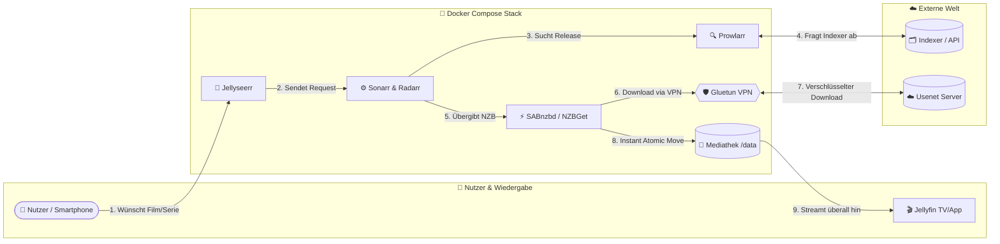

<div align="center">

# 🧭 Usenet-Kompass

**Der umfassende deutsche Leitfaden für automatisierte Usenet-Downloads, Medienserver und Heimkino mit Docker Compose.**

[](https://www.docker.com/)
[](https://dietpi.com/)
[](https://tailscale.com/)
[](https://www.wireguard.com/)
[](https://github.com/KAiSER086/Usenet-Kompass/stargazers)
[](LICENSE)

<br>

<p align="center">
  <b>🔒 Sicher & Anonym &nbsp;•&nbsp; ⚡ Gigabit-Ready &nbsp;•&nbsp; 🤖 100 % Automatisiert</b><br>
  <i>Vom ersten Provider-Account bis zur vollautomatischen Mediathek mit Jellyfin & Jellyseerr.</i>
</p>

---

</div>

> [!TIP]
> **Schlüsselfertig & Ressourcenoptimiert:** Dieses Setup ist für den zuverlässigen, lautlosen 24/7-Dauerbetrieb mit minimalem Stromverbrauch konzipiert – optimiert für **Raspberry Pi 5**, stromsparende Mini-PCs (z. B. Intel N100) oder jeden beliebigen Linux-Server (DietPi, Debian, Ubuntu).

## 💡 Über dieses Projekt

Der **Usenet-Kompass** führt dich Schritt für Schritt zum perfekten privaten Medien-Setup. Alle Dienste laufen isoliert in Docker-Containern und greifen nahtlos ineinander:

* 🔒 **Maximale Privatsphäre:** VPN-Tunnelung mit Gluetun (WireGuard inkl. Kill-Switch) und SSL/TLS-verschlüsselte NNTP-Verbindungen (Port 563/443).
* 🌐 **Sicherer Fernzugriff:** Voller Zugriff von unterwegs über Tailscale Mesh-VPN – ganz ohne offene Ports an deinem Router.
* 🤖 **100 % Automatisierung:** Medienanfragen über Jellyseerr werden automatisch an Sonarr & Radarr übergeben und von NZBGet/SABnzbd geladen.
* ⚡ **Instant Atomic Moves:** Konsequenter TRaSH-Guides Standard – fertige Medien werden in Millisekunden ohne doppelte Schreiblast verschoben.
* 🇩🇪 **Fokus auf German Releases:** Vorkonfigurierte Custom Formats für deutsche Tonspuren und zweisprachige Releases (*German DL*).

---

## 🔄 Der automatisierte Workflow



---

## 📦 Die Dienste im Überblick

| Dienst | Port | Kategorie | Beschreibung |
|:---|:---:|:---:|:---|
| **[Gluetun](Docker%20Compose%20Stack/VPNs.md#41-das-netzwerk-sichern-mit-gluetun)** | — | 🛡️ Sicherheit | VPN-Client (WireGuard/OpenVPN) mit integriertem Kill-Switch. |
| **[Tailscale](Docker%20Compose%20Stack/VPNs.md#42-tailscale-dienst-auf-dem-host-system-hinzufügen)** | — | 🌐 Netzwerk | Sicheres Mesh-VPN für verschlüsselten Fernzugriff von unterwegs. |
| **[NZBGet](Downloader/Sabnzbd%20vs%20NZBGet.md)** | `6789` | ⚡ Downloader | Ressourcenschonende C++ Performance-Rakete; reizt Gigabit auf dem Pi 5 voll aus. |
| **[SABnzbd](Downloader/Sabnzbd%20vs%20NZBGet.md)** | `8080` | ⚡ Downloader | Komfortabler Allrounder mit Auto-PAR2-Reparatur und Direkt-Entpacken. |
| **[Prowlarr](Arr-Stack/Prowlarr%2C%20Sonarr%2C%20Radarr.md#631-prowlarr-einrichten)** | `9696` | 🔍 Indexer-Hub | Zentrale Schnittstelle zur Verwaltung aller Usenet-Indexer. |
| **[Sonarr](Arr-Stack/Prowlarr%2C%20Sonarr%2C%20Radarr.md#632-sonarr--radarr-einrichten)** | `8989` | 📺 Serien | Automatische Überwachung, Suche und Verwaltung von Serien. |
| **[Radarr](Arr-Stack/Prowlarr%2C%20Sonarr%2C%20Radarr.md#632-sonarr--radarr-einrichten)** | `7878` | 🎬 Filme | Automatischer Film-Manager für Downloads und Qualitäts-Upgrades. |
| **[Jellyfin](Frontend/Jellyfin%20und%20Jellyseer.md#71-jellyfin-zum-docker-stack-hinzufügen)** | `8096` | 🍿 Streaming | 100 % quelloffener Medienserver für Smart-TV, PC & Smartphone. |
| **[Jellyseerr](Frontend/Jellyfin%20und%20Jellyseer.md#72-jellyseerr-zum-docker-stack-hinzufügen)** | `5055` | 🎯 Discovery | Modernes Medienanfrage-Portal für dich, Freunde und Familie. |

---

## 📑 Inhaltsverzeichnis

| Kapitel | Leitfaden | Kerninhalte |
|:---:|:---|:---|
| **`1.0`** | **[Grundlagen](Grundlagen/Grundlagen.md#10-grundlagen)** | Usenet vs. Torrent, Rechtslage in DE, Hardware-Wahl (Pi 5 vs. N100), Transkodierung |
| **`2.0`** | **[Provider & Indexer](Provider%20%26%20Indexer/Provider%20%26%20Indexer.md#20-provider-und-indexer)** | Retention, Backbones, Block-Accounts, deutsche Indexer (*Treasure-Maps*, *NewzBay*) |
| **`3.0`** | **[Docker Compose Vorbereitung](Docker%20Compose%20Stack/Docker%20Compose%20Stack.md#30-der-docker-compose-stack)** | Grundlagen zu Containern, Installation für Debian, DietPi, Ubuntu, CentOS, Arch |
| **`4.0`** | **[VPN- & Mesh-Netzwerk](Docker%20Compose%20Stack/VPNs.md#40-vpn--und-mesh-konfiguration)** | Gluetun (WireGuard vs. OpenVPN), LAN-Bypass & Tailscale-Fernzugriff |
| **`5.0`** | **[Usenet Downloader](Downloader/Sabnzbd%20vs%20NZBGet.md#50-usenet-downloader-sabnzbd-vs-nzbget)** | NZBGet vs. SABnzbd Performance-Vergleich, Direct Unpack & Server-Prioritäten |
| **`6.0`** | **[Automatisierung (*arr)](Arr-Stack/Prowlarr%2C%20Sonarr%2C%20Radarr.md#60-prowlarr-sonarr-und-radarr)** | Prowlarr Sync, TRaSH-Guides Speicherstruktur (`/data`), German DL Custom Formats |
| **`7.0`** | **[Frontend: Streaming & Requests](Frontend/Jellyfin%20und%20Jellyseer.md#70-jellyfin--jellyseerr-das-frontend-deiner-mediathek)** | Jellyfin Einrichtung, Intel QuickSync Hardware-Transcoding & Jellyseerr Portal |
| **`8.0`** | **[Der finale Stack](Docker%20Compose%20Stack/Finaler%20Stack.md#80-der-komplette-docker-stack)** | Vollständige, schlüsselfertige `docker-compose.yml` für alle Dienste |
| **`📖`** | **[Usenet-Lexikon](Lexikon/Lexikon.md#usenet-lexikon)** | Glossar: Retention, Parität (PAR2), Remux, German DL, Newznab, Atomic Moves |

---

## ⚡ Schnellstart in 3 Schritten

```bash
# 1. Repository klonen
git clone https://github.com/KAiSER086/Usenet-Kompass.git
cd Usenet-Kompass

# 2. Empfohlene TRaSH-Guides Verzeichnisstruktur anlegen
mkdir -p data/usenet/complete data/usenet/incomplete data/media/movies data/media/tv

# 3. Finalen Stack anpassen und starten
cd "Docker Compose Stack"
# Passe deine Zugangsdaten in der docker-compose.yml an:
nano "Finaler Stack.md"
```

---

<div align="center">

⭐ **Gefällt dir das Projekt?** Lass gerne einen Stern da!

</div>