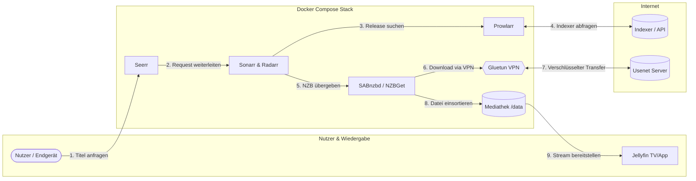

<div align="center">

# Usenet-Kompass

**Der umfassende deutsche Leitfaden für automatisierte Usenet-Downloads, Medienserver und Heimkino mit Docker Compose.**

[](https://github.com/KAiSER086/Usenet-Kompass/actions/workflows/ci.yml)
[](https://www.docker.com/)
[](https://dietpi.com/)
[](https://tailscale.com/)
[](https://www.wireguard.com/)
[](https://github.com/KAiSER086/Usenet-Kompass/stargazers)
[](LICENSE)

<br>

<p align="center">
  <b>Sicher & Anonym &nbsp;•&nbsp; Ressourceneffizient &nbsp;•&nbsp; Vollautomatisiert</b><br>
  <i>Vom ersten Provider-Account bis zur einsatzbereiten Mediathek mit Jellyfin & Seerr.</i>
</p>

---

</div>

> [!NOTE]
> **Ressourcenoptimiert für Dauerbetrieb:** Dieses Setup ist für den zuverlässigen, lautlosen 24/7-Betrieb mit minimalem Stromverbrauch konzipiert – optimiert für **Raspberry Pi 5**, stromsparende Mini-PCs (z. B. Intel N100) sowie gängige Linux-Distributionen (Debian, Ubuntu, DietPi, Fedora, openSUSE, Arch Linux).

## Über dieses Projekt

Der **Usenet-Kompass** führt Schritt für Schritt zum privaten Medien-Setup. Alle Dienste laufen isoliert in Docker-Containern und greifen nahtlos ineinander:

* **Privatsphäre & Sicherheit:** VPN-Tunnelung mit Gluetun (WireGuard mit Kill-Switch) und SSL/TLS-verschlüsselte Verbindungen zum Usenet-Provider.
* **Sicherer Fernzugriff:** Zugriff von unterwegs über Tailscale Mesh-VPN ohne offene Ports oder Portweiterleitungen am Heimrouter.
* **Vollständige Automatisierung:** Medienanfragen über Seerr werden automatisch an Sonarr & Radarr übergeben und über NZBGet oder SABnzbd heruntergeladen.
* **Effiziente Dateiverwaltung:** Standardisierte Verzeichnisstruktur nach TRaSH-Guides – fertige Downloads werden verzögerungsfrei und ohne doppelte Schreiblast in die Mediathek verschoben.
* **Fokus auf deutsche Inhalte:** Vorkonfigurierte Profile und Custom Formats für deutsche Tonspuren und zweisprachige Veröffentlichungen (German DL).

---

## Workflow



---

## Dienste im Überblick

| Dienst | Port | Kategorie | Beschreibung |
|:---|:---:|:---:|:---|
| **[Gluetun](Docker%20Compose%20Stack/VPNs.md#41-das-netzwerk-sichern-mit-gluetun)** | — | Sicherheit | VPN-Client (WireGuard/OpenVPN) mit Kill-Switch für Downloader und Indexer. |
| **[Tailscale](Docker%20Compose%20Stack/VPNs.md#42-tailscale-dienst-auf-dem-host-system-hinzufügen)** | — | Netzwerk | Privates Mesh-VPN für verschlüsselten Fernzugriff von unterwegs. |
| **[SABnzbd](Downloader/Sabnzbd%20vs%20NZBGet.md)** | `8080` | Downloader | Moderner, leistungsstarker Usenet-Downloader (Standard) mit Direct Unpack, Auto-PAR2 und voller Gigabit-Power. |
| **[NZBGet](Downloader/Sabnzbd%20vs%20NZBGet.md)** | `6789` | Downloader | Schlankes C++ Leichtgewicht mit minimalem RAM-Verbrauch (< 60 MB), ideal für Systeme mit < 2 GB RAM. |
| **[Prowlarr](Arr-Stack/Prowlarr%2C%20Sonarr%2C%20Radarr.md#631-prowlarr-einrichten)** | `9696` | Indexer-Hub | Zentrale Verwaltung aller Usenet-Indexer mit nativer Synchronisation. |
| **[Sonarr](Arr-Stack/Prowlarr%2C%20Sonarr%2C%20Radarr.md#632-sonarr--radarr-einrichten)** | `8989` | Serien | Automatisierte Suche, Überwachung und Verwaltung von Serien. |
| **[Radarr](Arr-Stack/Prowlarr%2C%20Sonarr%2C%20Radarr.md#632-sonarr--radarr-einrichten)** | `7878` | Filme | Automatisierte Suche, Verwaltung und Qualitäts-Upgrades für Spielfilme. |
| **[Jellyfin](Frontend/Jellyfin%20und%20Seerr.md#71-jellyfin-zum-docker-stack-hinzufügen)** | `8096` | Streaming | Quelloffener Medienserver für Smart-TVs, Mobilgeräte und Browser. |
| **[Seerr](Frontend/Jellyfin%20und%20Seerr.md#72-seerr-zum-docker-stack-hinzufügen)** | `5055` | Anfragen | Benutzerfreundliche Oberfläche zum Entdecken und Anfragen neuer Medien (Fusion aus Overseerr & Jellyseerr). |

---

## Inhaltsverzeichnis

| Kapitel | Leitfaden | Kerninhalte |
|:---:|:---|:---|
| **`1.0`** | **[Grundlagen](Grundlagen/Grundlagen.md#10-grundlagen)** | Usenet-Funktionsweise, Hardware-Wahl (Pi 5, Mini-PC oder Cloud VPS), Transkodierung |
| **`2.0`** | **[Provider & Indexer](Provider%20%26%20Indexer/Provider%20%26%20Indexer.md#20-provider-und-indexer)** | Retention, Backbones, Block-Accounts, deutsche Indexer (*Treasure-Maps*, *NewzBay*) |
| **`3.0`** | **[Docker Vorbereitung](Docker%20Compose%20Stack/Docker%20Compose%20Stack.md#30-der-docker-compose-stack)** | Container-Grundlagen, Installation unter Debian, Ubuntu, DietPi, Fedora, openSUSE, Arch |
| **`4.0`** | **[VPN & Netzwerk](Docker%20Compose%20Stack/VPNs.md#40-vpn--und-mesh-konfiguration)** | Gluetun (WireGuard / OpenVPN), LAN-Bypass und Tailscale-Einbindung |
| **`5.0`** | **[Usenet Downloader](Downloader/Sabnzbd%20vs%20NZBGet.md#50-usenet-downloader-sabnzbd-vs-nzbget)** | Vergleich von SABnzbd und NZBGet, Direct Unpack, I/O-Tuning und Benchmarks |
| **`6.0`** | **[Automatisierung](Arr-Stack/Prowlarr%2C%20Sonarr%2C%20Radarr.md#60-prowlarr-sonarr-und-radarr)** | Prowlarr-Sync, standardisierte Speicherpfade (`/data`), German DL Custom Formats |
| **`7.0`** | **[Streaming & Requests](Frontend/Jellyfin%20und%20Seerr.md#70-jellyfin--seerr-das-frontend-deiner-mediathek)** | Jellyfin Einrichtung, Hardware-Transkodierung (Intel QuickSync / VAAPI) & Seerr |
| **`8.0`** | **[Der finale Stack](Docker%20Compose%20Stack/Finaler%20Stack.md#80-der-komplette-docker-stack)** | Vollständige, vorkonfigurierte `docker-compose.yml` für alle Dienste |
| **`Glossar`** | **[Usenet-Lexikon](Lexikon/Lexikon.md#usenet-lexikon)** | Fachbegriffe verständlich erklärt: Retention, PAR2, Remux, German DL, Newznab |

---

## Schnellstart

### Option A: Automatischer Installer (Empfohlen)

Führe folgenden Befehl im Terminal deines Linux-Servers oder Raspberry Pi aus:

```bash
curl -fsSL https://raw.githubusercontent.com/KAiSER086/Usenet-Kompass/main/install.sh | bash
```

**Funktionsumfang des Installers:**
* **Betriebssystem- & Paketprüfung:** Erkennt die Linux-Distribution (Debian, Ubuntu, DietPi, Arch Linux, Fedora, openSUSE, Alpine etc.) und richtet Docker sowie Docker Compose automatisch über den passenden Paketmanager ein.
* **Hardwarebeschleunigung:** Erkennt vorhandene Grafikchipsätze (Intel QuickSync / VAAPI via `/dev/dri`) und bindet sie für Jellyfin ein.
* **Subnetz-Erkennung:** Ermittelt das lokale Heimnetzwerk (z. B. `192.168.178.0/24`) und hinterlegt es im LAN-Bypass der Firewall.
* **Downloader-Auswahl:** Ermöglicht die Wahl zwischen SABnzbd (Standard: moderne UI, Direct Unpack & volle Gigabit-Power) und NZBGet (Ressourcen-Leichtgewicht für < 2 GB RAM).
* **VPN-Integration & Leak-Test:** Richtet Gluetun ein, lädt benötigte Kernelmodule und prüft nach dem Start sofort die maskierte externe IP.
* **Automatisches App-Linking & TRaSH-Provisioning (`link-apps.sh`):** Liest API-Keys von Sonarr, Radarr und Prowlarr aus, synchronisiert die Dienste untereinander (`fullSync`), bindet Downloader an, konfiguriert das TRaSH Naming Scheme und richtet deutsche Custom Formats (`German DL` +1500, `German` +1000) inklusive Quality-Profile-Scoring vollautomatisch ein.

---

### Option B: Bestehende Installation nachträglich verknüpfen

Falls der Docker-Compose-Stack bereits läuft und lediglich die Verknüpfung von Prowlarr, Sonarr, Radarr und Downloader automatisiert werden soll:

```bash
curl -fsSL https://raw.githubusercontent.com/KAiSER086/Usenet-Kompass/main/link-apps.sh | bash
```

---

<details>
<summary><b>Option C: Manuelle Einrichtung mit Vorlage</b></summary>

Falls du den Stack lieber Schritt für Schritt manuell konfigurieren möchtest:

```bash
# 1. Repository klonen
git clone https://github.com/KAiSER086/Usenet-Kompass.git
cd Usenet-Kompass

# 2. Verzeichnisstruktur anlegen
mkdir -p data/usenet/complete/movies data/usenet/complete/tv data/usenet/incomplete data/media/movies data/media/tv config

# 3. Vorlage kopieren, Zugangsdaten anpassen und starten
cp docker-compose.example.yml docker-compose.yml
nano docker-compose.yml
docker compose up -d

# 4. Apps automatisch verknüpfen
chmod +x link-apps.sh
./link-apps.sh
```
</details>

---

<div align="center">

Wenn dir das Projekt hilft, freue ich mich über einen Stern auf GitHub.

</div>