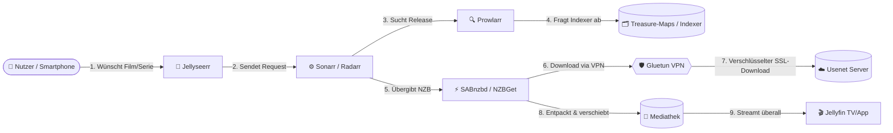



# 🧭 Usenet-Kompass

**Der umfassende deutsche Leitfaden für automatisierte Usenet-Downloads, Medienserver und Heimkino mit Docker Compose.**

 

  <b>Sicher. Automatisiert. Blitzschnell.</b> 
  Vom ersten Provider-Account bis zur vollautomatischen Mediathek mit Jellyfin & Jellyseerr.

---

## 💡 Über dieses Projekt

Der **Usenet-Kompass** richtet sich an alle, die sich ein performantes, sicheres und voll automatisiertes Medien-Setup aufbauen möchten – optimiert für **Raspberry Pi 5**, schlanke Mini-PCs (z. B. Intel N100) oder jedes beliebige Linux-System (DietPi / Debian / Ubuntu).

### 🚀 Warum dieses Setup?
* 🔒 **Maximale Privatsphäre:** VPN-Tunnelung mit Gluetun und verschlüsselte NNTP-Verbindungen (SSL/TLS).
* 🌐 **Sicherer Fernzugriff:** Voller Zugriff von unterwegs über Tailscale ohne offene Router-Ports.
* 🤖 **100 % Automatisierung:** Medienanfragen über Jellyseerr werden automatisch an Sonarr & Radarr übergeben und von SABnzbd heruntergeladen.
* ⚡ **Effizient & Stromsparend:** Für den zuverlässigen 24/7-Dauerbetrieb mit minimalem Stromverbrauch konzipiert.

---

## 🔄 Der automatisierte Workflow

---

## 📦 Die Dienste im Überblick

| Dienst | Port | Kategorie | Beschreibung |
|:---|:---:|:---:|:---|
| **[Gluetun](Docker%20Compose%20Stack/VPNs.md#41-das-netzwerk-sichern-mit-gluetun)** | — | 🛡️ Sicherheit | VPN-Client (WireGuard/OpenVPN) mit integriertem Kill-Switch. |
| **[Tailscale](Docker%20Compose%20Stack/VPNs.md#42-tailscale-dienst-auf-dem-host-system-hinzufügen)** | — | 🌐 Netzwerk | Sicheres Mesh-VPN für verschlüsselten Fernzugriff von unterwegs. |
| **[SABnzbd](Downloader/Sabnzbd%20vs%20NZBGet.md)** | `8080` | ⚡ Downloader | Moderner, komfortabler Usenet-Downloader mit Auto-PAR2-Reparatur. |
| **[NZBGet](Downloader/Sabnzbd%20vs%20NZBGet.md)** | `6789` | ⚡ Downloader | Ressourcenschonende C++ Alternative für maximale Performance. |
| **[Prowlarr](Arr-Stack/Prowlarr%2C%20Sonarr%2C%20Radarr.md#631-prowlarr-einrichten)** | `9696` | 🔍 Indexer-Hub | Zentrale Schnittstelle zur Verwaltung aller Usenet-Indexer. |
| **[Sonarr](Arr-Stack/Prowlarr%2C%20Sonarr%2C%20Radarr.md#632-sonarr--radarr-einrichten)** | `8989` | 📺 Serien | Automatische Überwachung, Suche und Verwaltung von Serien. |
| **[Radarr](Arr-Stack/Prowlarr%2C%20Sonarr%2C%20Radarr.md#632-sonarr--radarr-einrichten)** | `7878` | 🎬 Filme | Automatischer Film-Manager für Downloads und Qualitäts-Upgrades. |
| **[Jellyfin](Frontend/Jellyfin%20und%20Jellyseer.md#71-jellyfin-zum-docker-stack-hinzufügen)** | `8096` | 🍿 Streaming | 100 % werbefreier, privater Medienserver für TV, PC & Smartphone. |
| **[Jellyseerr](Frontend/Jellyfin%20und%20Jellyseer.md#72-jellyseerr-zum-docker-stack-hinzufügen)** | `5055` | 🎯 Discovery | Modernes Medienanfrage-Portal für dich, Freunde und Familie. |

---

## 📑 Inhaltsverzeichnis

### [1.0 Grundlagen](Grundlagen/Grundlagen.md#10-grundlagen)
* 1.1 [Was ist das Usenet? (Funktionsweise & Vorteile gegenüber Torrents)](Grundlagen/Grundlagen.md#11-was-ist-usenet)
* 1.2 [Systemvoraussetzungen & Hardware-Wahl (Raspberry Pi 5 vs. Mini-PC)](Grundlagen/Grundlagen.md#12-systemvoraussetzungen--hardware-wahl)

### [2.0 Provider & Indexer](Provider%20%26%20Indexer/Provider%20%26%20Indexer.md#20-provider-und-indexer)
* 2.1 [Usenet-Provider wählen (Retention, Geschwindigkeit, Backbones & Block-Accounts)](Provider%20%26%20Indexer/Provider%20%26%20Indexer.md#21-usenet-provider-wählen)
* 2.2 [Indexer finden (Deutsche & internationale Indexer, Boards & APIs)](Provider%20%26%20Indexer/Provider%20%26%20Indexer.md#22-indexer-finden)

### [3.0 Docker Compose Vorbereitung](Docker%20Compose%20Stack/Docker%20Compose%20Stack.md#30-der-docker-compose-stack)
* 3.1 [Grundlagen zu Docker & Compose](Docker%20Compose%20Stack/Docker%20Compose%20Stack.md#was-sind-docker-container-und-wie-funktionieren-sie)
* 3.2 [System vorbereiten (Installation für Debian, DietPi, Ubuntu, CentOS, Arch)](Docker%20Compose%20Stack/Docker%20Compose%20Stack.md#31-das-system-vorbereiten)

### [4.0 VPN- & Mesh-Netzwerk](Docker%20Compose%20Stack/VPNs.md#40-vpn--und-mesh-konfiguration)
* 4.1 [Das Netzwerk sichern mit Gluetun](Docker%20Compose%20Stack/VPNs.md#41-das-netzwerk-sichern-mit-gluetun)
* 4.2 [Sicherer Fernzugriff mit Tailscale](Docker%20Compose%20Stack/VPNs.md#42-tailscale-dienst-auf-dem-host-system-hinzufügen)

### [5.0 Usenet Downloader](Downloader/Sabnzbd%20vs%20NZBGet.md#50-usenet-downloader-sabnzbd-vs-nzbget)
* 5.1 [SABnzbd vs. NZBGet im Detailvergleich](Downloader/Sabnzbd%20vs%20NZBGet.md#sabnzbd-vs-nzbget-der-vergleich)
* 5.2 [Downloader zur `docker-compose.yml` hinzufügen](Downloader/Sabnzbd%20vs%20NZBGet.md#51-downloader-zur-docker-composeyml-hinzufügen)
* 5.3 [Provider-Einrichtung & SSL-Konfiguration](Downloader/Sabnzbd%20vs%20NZBGet.md#52-downloader-konfigurieren-usenet-provider)

### [6.0 Automatisierung: Prowlarr, Sonarr & Radarr](Arr-Stack/Prowlarr%2C%20Sonarr%2C%20Radarr.md#60-prowlarr-sonarr-und-radarr)
* 6.1 [Der *arr-Stack erklärt](Arr-Stack/Prowlarr%2C%20Sonarr%2C%20Radarr.md#61-was-ist-der-arr-stack)
* 6.2 [Installation & Speicherpfade (Best Practice für Hardlinks)](Arr-Stack/Prowlarr%2C%20Sonarr%2C%20Radarr.md#62-arr-apps-installieren)
* 6.3 [Einrichtung & Synchronisation](Arr-Stack/Prowlarr%2C%20Sonarr%2C%20Radarr.md#63-arr-apps-konfigurieren)

### [7.0 Frontend: Jellyfin & Jellyseerr](Frontend/Jellyfin%20und%20Jellyseer.md#70-jellyfin--jellyseerr-das-frontend-deiner-mediathek)
* 7.1 [Jellyfin Streaming-Server hinzufügen](Frontend/Jellyfin%20und%20Jellyseer.md#71-jellyfin-zum-docker-stack-hinzufügen)
* 7.2 [Jellyseerr Discovery-Portal einbinden](Frontend/Jellyfin%20und%20Jellyseer.md#72-jellyseerr-zum-docker-stack-hinzufügen)

### [8.0 Der finale Stack](Docker%20Compose%20Stack/Finaler%20Stack.md#80-der-komplette-docker-stack)
* [Komplette, schlüsselfertige `docker-compose.yml`](Docker%20Compose%20Stack/Finaler%20Stack.md#80-der-komplette-docker-stack)

---

### 📖 [Usenet-Lexikon](Lexikon/Lexikon.md#usenet-lexikon)
* [Glossar für alle wichtigen Fachbegriffe (Retention, Parität, Remux, German DL, Newznab etc.)](Lexikon/Lexikon.md#usenet-lexikon)

---

⭐ **Gefällt dir das Projekt?** Lass gerne einen Stern da!

